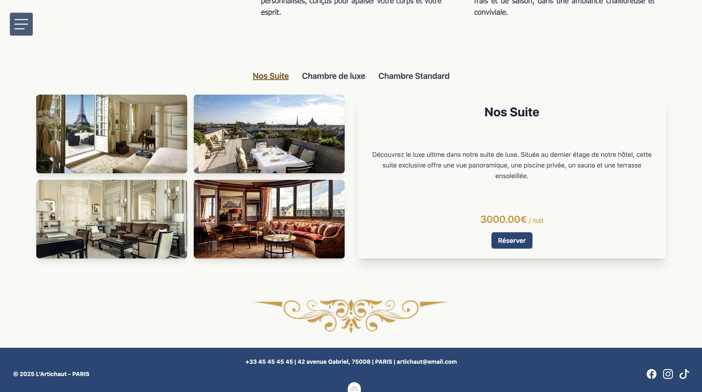
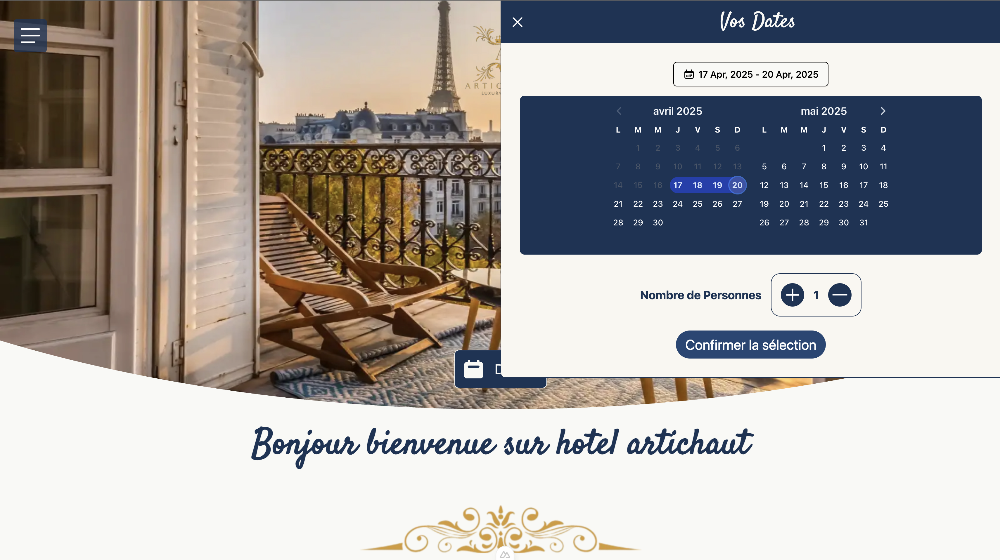
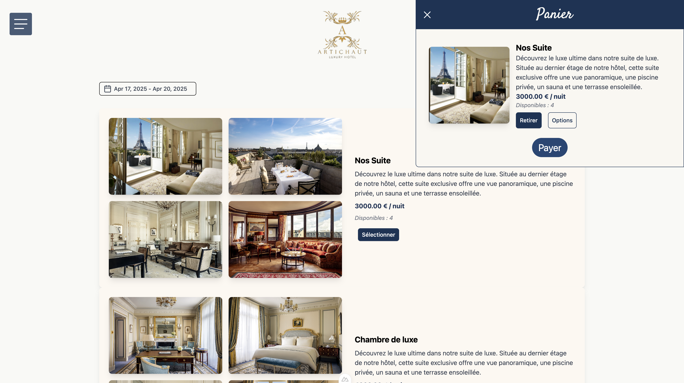
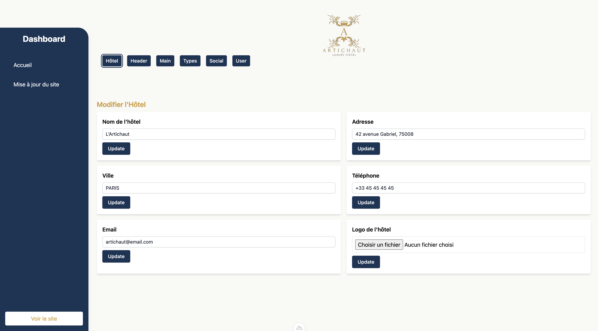

# Projet-Hotel-Laravel-API-Nuxt









>- __serveur :__
>>```javascript
>>php artisan serve
>>```

>- __regénerer les migrations:__
>>```javascript
>>php artisan migrate:refresh
>>```

> __make migration__
>>```javascript
>> php artisan make:migration  nom de la migration
>>```

> __génere la migration__
>> ```javascript
>> php artisan migrate
>>```

> __make model__
>> ```javascript
>> php artisan make:model  nom de la table
>>```
>__Dans le model indiquer le nom de la table utiliser et les valeurs accsesible__
>>```javascript
>>protected $table = 'product';
>>protected $fillable = ["name","description", "price", "image"];
>>```

> __make Seeder__
>> ```javascript
>> php artisan make:Seeder Product
>>```

>__seeder migration__ 
>>__Migrate + seed__
>>```javascript
>> php artisan migrate:fresh --seed   
>>```
